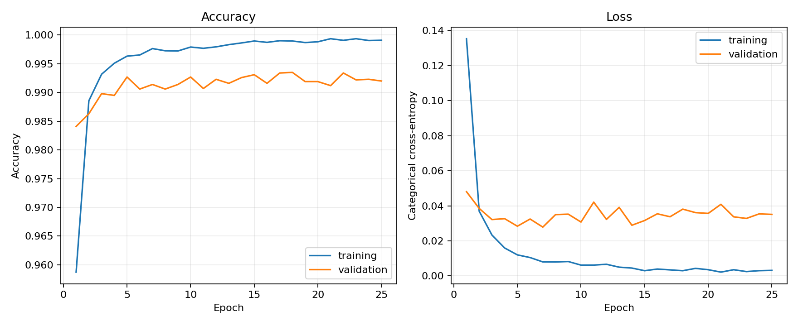

# Reproduction results

This run executed the complete 25-epoch MNIST experiment described in sections
3.6.1–3.6.4 of the paper.

## Configuration

- Date: 2026-09-07
- Platform: Apple Silicon (`arm64`), macOS 26.6.2
- Python: 3.11.1
- TensorFlow: 2.16.1
- Random seed: 42
- Training/test samples: 60,000 / 10,000
- Epochs: 25
- Batch size: 128
- Dropout: disabled, matching the base architecture
- Trainable parameters: 3,274,634

## Results

| Measurement | Reproduction | Paper |
|---|---:|---:|
| Final test accuracy | **99.20%** | 99.29% |
| Final test loss | **0.03511** | 0.06949 |
| Best validation accuracy | **99.35%** (epoch 18) | Not reported |
| Lowest validation loss | **0.02786** (epoch 7) | Not reported |
| Final training accuracy | **99.91%** | Not reported |

The reproduced test accuracy is 0.09 percentage points below the paper's
reported value. This is a close match given the paper does not publish its
random seed, batch size, exact TensorFlow version, or trained weights.

The architecture matches the published parameter count exactly. The
lightweight safety-framework tests also pass.

Raw values are available in `metrics.json` and `history.csv`. The trained model
is intentionally omitted because it can be regenerated with the documented
command and would add a large binary to the repository.

